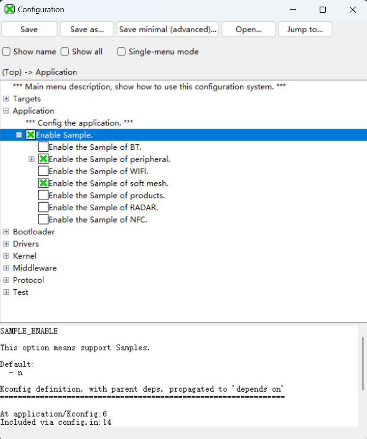

# 面向分布式节点的软组网协议设计与实现(Soft Mesh)

## 一、前言

### 1.1 背景

在调研现有开源方案时发现，支持IEEE 802.11s标准的WiFi网卡可在数据链路层实现Mesh网络接口，并且理论上能够部署B.A.T.M.A.N.方案。然而，对于不支持该标准但具备STA和AP模式的WiFi网卡，仍可通过软件层实现Mesh网络功能。我们将此类方案称为“软Mesh”。目前，尚无通用开源的软Mesh版本。尽管一些嵌入式开发板（如ESP32）具备Mesh功能，但厂家对Mesh功能进行了封包闭源，用户只能使用提供的头文件接口，无法调整其内部实现算法，灵活性大幅降低，在某些场景下难以满足特定业务需求。

在不支持IEEE 802.11s标准的WiFi网卡上，Mesh网络难以直接实现，但在硬件支持WiFi STA和AP模式共存的情况下，Mesh网络的功能可以通过软件定义的方式实现。早期的ESP8266通过easyMesh实现了类似功能，验证了软Mesh的可行性。本Soft Mesh方案旨在为不支持IEEE 802.11s标准但具备STA和AP功能的开发板，提供一种简便的Mesh网络实现方式，使其在数据链路层之外通过软件层支持Mesh网络。

### 1.2 目的

本项目旨在设计并实现一种基于软件的Mesh网络方案，解决不支持IEEE 802.11s标准的WiFi网卡在Mesh组网上的难题。该方案通过软件定义的方式，利用STA和AP模式共存的WiFi功能，以应用层实现Mesh功能。借此方法，提供一种可扩展、易于移植且适用于多种硬件环境的通用Soft Mesh解决方案，为特定开发板及不同通信方式（如蓝牙、星闪）提供便捷的Mesh网络支持。

### 1.3 方案概述
Soft Mesh方案基于支持STA和AP模式的开发板，其中STA和AP模式不仅限于WiFi通信，还可以抽象出其他通信方式的中继特性，使开发板既可连接其他节点，也可被其他节点连接。为增强适用性，本方案对硬件接口层进行了抽象，使其理论上不受特定硬件限制，便于移植到其他通信方式上（例如蓝牙和星闪）。该方案通过构建高移植性、模块化和自组织的N叉树结构Mesh网络（N代表AP支持的最大连接数），进一步提升了Soft Mesh的可应用性。

### 1.4 技术设计与实现
Soft Mesh方案通过应用层实现Mesh功能，仅需移植WiFi驱动相关接口并提供标准socket接口即可完成。这种设计不仅实现了WiFi Mesh网络功能，还在代码结构上考虑了高移植性与扩展性。通过解耦硬件接口，Soft Mesh方案具备良好的移植能力，可便捷应用于其他具备中继功能的开发板或其他通信方式。

### 1.5 预期目标

1. **去中心化**：网络能够在任意节点崩溃后实现自愈恢复。
2. **自组织**：节点之间可自主选择连接，自动构建网络。
3. **节点互通**：实现任意两个节点之间的多跳通信。
4. **高移植性**：Mesh 网络代码与硬件驱动解耦，支持蓝牙、星闪等其他通信方式。
5. **模块化设计**：各模块独立开发，便于不同算法的对比和优化。

## 二、项目结构

### 2.1 软件架构

软件架构如下所示

~~~
+-----------------------------------------------------------+
|                    应用接口层（API）                         |
|       - Mesh初始化接口     - 数据传输接口                    |
|       - 广播与单播接口     - 网络状态检查接口                 |
+-----------------------------------------------------------+
|             节点管理与优化层（Node Management）待实现          |
|       - 节点选举与合并     - 节点负载均衡与优化                |
|       - 低功耗休眠管理     - 故障与网络优化                   |
+-----------------------------------------------------------+
|               安全与认证层（Security）待实现                   |
|       - 节点认证           - 数据加密与解密                   |
|       - 密钥管理           - 安全连接管理                     |
+-----------------------------------------------------------+
|             网络状态管理层（Network FSM）                    |
|       - 网络初始化         - STA/AP连接管理                  |
|       - 根节点创建         - 根节点冲突检测                    |
|       - 网络扫描           - 邻居节点管理                      |
+-----------------------------------------------------------+
|             路由与数据传输层（Routing & Transport）           |
|       - 路由数据包管理     - MAC/IP绑定管理                   |
|       - 数据包发送与接收   - 网络拓扑监控与同步                |
+-----------------------------------------------------------+
|               硬件抽象层（HAL）                              |
|       - Wi-Fi配置接口       - AP与STA模式管理                 |
|       - 数据包收发         - 蓝牙/星闪预留接口                |
+-----------------------------------------------------------+
|               测试层（Test Modules）                         |
|       - Wi-Fi功能测试       - 无线接口测试                    |
|       - Mesh API测试       - 路由与传输测试                   |
|       - 网络状态测试       - 路由层消息队列测试                |
+-----------------------------------------------------------+
~~~

### 2.2 仓库目录结构

仓库的目录结构及介绍如下

~~~
/soft_mesh
│
├── CMakeLists.txt                 # 项目根目录的构建文件
├── LICENSE                        # 开源许可证
├── README.md                      # 中文README文档
├── README.en.md                   # 英文README文档
├── /hal                           # 硬件抽象层（HAL）
│   ├── CMakeLists.txt             # 硬件抽象层构建文件
│   ├── /inc                       # 硬件抽象层头文件
│   │   ├── hal_wifi.h             # WiFi操作接口定义
│   │   └── hal_wireless.h         # 无线通信接口定义
│   ├── /src                       # 硬件抽象层实现文件
│   │   ├── CMakeLists.txt         # 硬件实现文件构建文件
│   │   ├── hal_wifi.c             # WiFi接口实现
│   │   └── hal_wireless.c         # 无线通信接口实现
│   └── /test                      # 硬件抽象层测试文件
│       ├── CMakeLists.txt         # 测试文件构建配置
│       ├── test_wifi.c            # WiFi功能测试
│       └── test_wireless.c        # 无线通信功能测试
│
├── /mesh_api                      # Mesh网络接口层
│   ├── CMakeLists.txt             # Mesh API模块构建文件
│   ├── /inc                       # Mesh API头文件
│   │   └── mesh_api.h             # Mesh核心接口定义
│   ├── /src                       # Mesh API实现文件
│   │   ├── CMakeLists.txt         # Mesh实现文件构建文件
│   │   └── mesh_api.c             # Mesh核心接口实现
│   └── /test                      # Mesh API测试文件
│       ├── CMakeLists.txt         # 测试文件构建配置
│       └── test_api.c             # Mesh接口测试
│
├── /network                       # 网络状态管理层
│   ├── CMakeLists.txt             # 网络状态管理模块构建文件
│   ├── /inc                       # 网络状态管理头文件
│   │   └── network_fsm.h          # 网络状态机接口定义
│   ├── /src                       # 网络状态管理实现文件
│   │   ├── CMakeLists.txt         # 网络实现文件构建文件
│   │   └── network_fsm.c          # 网络状态管理逻辑实现
│   └── /test                      # 网络状态管理测试文件
│       ├── CMakeLists.txt         # 测试文件构建配置
│       └── test_network.c         # 网络状态管理接口测试
│
└── /routing_transport             # 路由与传输层
    ├── CMakeLists.txt             # 路由与传输层构建文件
    ├── /inc                       # 路由与传输层头文件
    │   └── routing_transport.h    # 路由与传输核心接口定义
    ├── /src                       # 路由与传输层实现文件
    │   ├── CMakeLists.txt         # 路由实现文件构建文件
    │   └── routing_transport.c    # 数据包路由与传输实现
    └── /test                      # 路由与传输层测试文件
        ├── CMakeLists.txt         # 测试文件构建配置
        └── test_routing.c         # 路由与传输功能测试

~~~

## 三、安装与环境配置

目前该项目是基于Hi3863E开发设计的，请在参考[快速上手教程](https://gitee.com/HiSpark/fbb_ws63/tree/master/tools)配置好Hi3863的编译环境后，将本仓库的源码放到源码下的`application\samples`文件夹下，在`application\samples\CMakeLists.txt`中的适当位置添加下面配置代码

~~~cmake
if(DEFINED CONFIG_ENABLE_SOFT_MESH_SAMPLE)
    add_subdirectory_if_exist(soft_mesh)
endif()
~~~

在`application\samples\Kconfig`的适当位置添加下面的代码

~~~makefile
config ENABLE_SOFT_MESH_SAMPLE
    bool
    prompt "Enable the Sample of soft mesh."
    default n
    depends on SAMPLE_ENABLE
    help
        This option means enable the sample of soft mesh.
~~~

配置成功之后点击系统配置按钮，就能看到加进去的我们的配置代码，启动**Enable the sample of soft mesh**其前面有一个×表示选择成功，**注意一定要关闭其他无线通信的程序**，否则其他无线通信的程序会抢用一些硬件相关的函数导致Soft Mesh程序运行失败。

启动该Soft Mesh配置之后，运行重编译执行程序编译。

## 四、使用示例

`application\samples\soft_mesh\mesh_api\test\test_api.c`是测试API层接口的代码，在`application\samples\soft_mesh\mesh_api\test\CMakeLists.txt`里面开启对test_api的编译（默认是开启的）

test_api.c的代码如下，该代码创建一个线程执行test_api_task函数，函数首先初始化Mesh网络的配置，然后进入死循环等待入网成功，当入网成功之后，就会非阻塞从消息队列里接收发给该节点的消息，如果收到消息，则回应Hi, Node!

在这个测试场景下，将其中的一个节点烧录广播函数的代码，即取消掉广播函数的注释，该节点会向其他Mesh网络的节点广播数据。

将多个节点节点烧录不广播的代码

将一个节点烧录广播的代码

节点都上电之后通过串口查看对应的效果。

~~~c
#include <stdio.h>
#include <string.h>
#include "cmsis_os2.h"
#include "app_init.h"
#include "mesh_api.h"

// 定义宏开关，打开或关闭日志输出
#define ENABLE_LOG 1  // 1 表示开启日志，0 表示关闭日志

// 定义 LOG 宏，如果 ENABLE_LOG 为 1，则打印日志，并输出文件名、行号、日志内容
#if ENABLE_LOG
    #define LOG(fmt, ...) printf("LOG [%s:%d]: " fmt "\n", __FILE__, __LINE__, ##__VA_ARGS__)
#else
    #define LOG(fmt, ...) do { UNUSED(fmt); } while (0) 
#endif

void test_api_task(void)
{
    LOG("test_api_task run...\n");
    // 设置Mesh网络的SSID和密码
    if(mesh_init("FsrMesh", "12345678") != 0) {
        LOG("mesh_init failed.\n");
    } else {
        LOG("mesh_init successfully.\n");
    }
    while (1)
    {
        if (mesh_network_connected() == 0) {
            LOG("Mesh network not connected.\n");
            osDelay(100);
            continue;
        }
        osDelay(100);
        // if (mesh_broadcast("Hello, Mesh!") != 0) {
        //     LOG("mesh_broadcast failed.\n");
        // } else {
        //     LOG("mesh_broadcast successfully.\n");
        // }
        char src_mac[7] = {0};
        src_mac[6] = '\0';
        char data[512] = {0};
        if(mesh_recv_data(src_mac, data) == 0) {
            LOG("Received data from client: %s, MAC: %s\n", data, src_mac);
        }else {
            LOG("no data recv.\n");
            continue;
        }
        LOG("say hi to mac: %s\n", src_mac);
        mesh_send_data(src_mac, "Hi, Node!");
    }
    
}

/* 创建任务 */
static void sta_sample_entry(void)
{
    osThreadAttr_t attr;
    attr.name       = "test_api_task";
    attr.attr_bits  = 0U;
    attr.cb_mem     = NULL;
    attr.cb_size    = 0U;
    attr.stack_mem  = NULL;
    attr.stack_size = 0x1000;
    attr.priority   = osPriorityLow4;

    if (osThreadNew((osThreadFunc_t)test_api_task, NULL, &attr) == NULL) {
        LOG("Create test_api_task failed.\n");
    } else {
        LOG("Create test_api_task successfully.\n");
    }
}

/* 启动任务 */
app_run(sta_sample_entry);
~~~

## 五、API文档

本API文档提供了Soft Mesh网络实现中的核心接口，包括Wi-Fi管理、无线通信模块操作、Mesh网络初始化和数据传输、网络状态管理以及路由和数据包传输。以下是主要API的详细说明。为了降低代码的耦合度，对于用户而言，能调用与mesh功能相关的应该只是mesh_api.h的函数，如果需要的功能mesh_api.h未提供，可以自己实现对应的函数，将其封装到mesh_api.c。

### 5.1 Mesh API接口 (mesh_api.h)

为Mesh网络提供核心操作接口，包括初始化、连接状态检测和数据传输：

**网络初始化：**

`mesh_init()`：初始化Mesh网络，设置SSID和密码。
**数据传输：**

`mesh_send_data()`：向指定MAC地址发送数据。
`mesh_broadcast()`：向所有节点广播数据。
`mesh_recv_data()`：接收数据包。
**连接状态：**

`mesh_network_connected()`：检查网络连接状态。

### 5.2 路由与传输管理 (routing_transport.h)

此模块管理Mesh网络的路由和数据包传输，支持多节点通信的核心功能：

**数据包管理：**

`generate_data_packet()`：生成数据包。
`broadcast_data_packet()`：广播数据包。
`send_data_packet()`：向指定MAC地址发送数据包。
**路由管理：**

`route_transport_task()`：执行路由传输任务，维护网络拓扑结构。

### 5.3 网络状态管理 (network_fsm.h)

该模块实现了网络状态机，通过不同状态处理设备的扫描、连接、创建与维护Mesh网络的操作：

**状态机管理：**
`network_fsm_init()`：初始化网络状态机。
`network_fsm_run()`：进入状态机主循环，处理状态转移。
**状态处理：**
`state_scanning()`：扫描并选择最佳的Mesh网络。
`state_create_root()`：创建新的根节点。

### 5.4 无线通信管理 (hal_wireless.h)

此模块为不同类型的无线通信（Wi-Fi、蓝牙、星闪）提供硬件抽象层接口，支持模块初始化、连接、扫描、数据传输等操作。

**初始化与管理：**
`HAL_Wireless_Init()`：初始化指定无线通信类型的模块，配置资源。
`HAL_Wireless_Deinit()`：释放指定无线通信模块的资源。
`HAL_Wireless_Start()`：启动无线通信模块（如Wi-Fi的STA模式，蓝牙的连接模式）。
`HAL_Wireless_Stop()`：停止无线通信模块。
AP模式与扫描：
`HAL_Wireless_EnableAP()`：启用AP模式（如Wi-Fi AP或蓝牙广播），配置SSID、密码、信道等。
`HAL_Wireless_DisableAP()`：禁用AP模式。
`HAL_Wireless_Scan()`：扫描指定类型的无线网络，将结果存储在results中。

**连接与设备信息：**
`HAL_Wireless_Connect()`：连接到指定的无线设备（如Wi-Fi AP）。
`HAL_Wireless_Disconnect()`：断开当前无线连接。
`HAL_Wireless_GetIP()`：获取当前IP地址（Wi-Fi专用）。
`HAL_Wireless_GetConnectedDeviceInfo()`：获取连接的设备信息（如STA设备的MAC地址、信号强度等）。
`HAL_Wireless_GetAPMacAddress()`：获取AP模式的MAC地址。
`HAL_Wireless_GetNodeMAC()`：获取当前节点的MAC地址。

**数据传输：**
`HAL_Wireless_SendData_to_child()`：向指定子节点（或上层节点）发送数据。
`HAL_Wireless_SendData_to_parent()`：向父节点发送数据。
`HAL_Wireless_ReceiveData()`：接收来自其他节点的数据。
`HAL_Wireless_ReceiveDataFromClient()`：接收客户端发送的数据，返回MAC地址和数据内容。

**服务器管理：**
`HAL_Wireless_CreateServer()`：创建无线接收服务器。
`HAL_Wireless_CloseServer()`：关闭指定服务器实例。
`HAL_Wireless_GetChildMACs()`：获取所有子节点的MAC地址，返回子节点数量。

### 5.5 Wi-Fi管理 (hal_wifi.h)

该模块包含Wi-Fi的初始化、连接、配置及数据传输的相关接口，支持STA和AP模式：

**初始化与去初始化：**
`HAL_WiFi_Init()`：初始化Wi-Fi模块。
`HAL_WiFi_Deinit()`：释放Wi-Fi资源。
**STA模式：**
`HAL_WiFi_Connect()`：连接到指定的Wi-Fi网络。
`HAL_WiFi_GetIP()`：获取IP地址。
**AP模式：**
`HAL_WiFi_AP_Enable()`：启动AP模式。
`HAL_WiFi_GetAPConfig()`：获取AP配置信息。
**数据传输：**
`HAL_WiFi_Send_data()`：通过Wi-Fi发送数据。
`HAL_WiFi_Receive_data()`：接收Wi-Fi数据。

这些API涵盖了Soft Mesh网络系统的核心功能，从硬件操作到网络通信、数据传输和路由管理，提供了完整的接口支持。

## 六、设计细节

## 七、FAQ与故障排查

解答常见问题，提供在运行过程中可能遇到的故障及解决方法。

## 八、贡献指南

感谢您对本项目的兴趣和支持！我们欢迎社区成员为本项目贡献代码或提出改进建议。请遵循以下步骤和指南，以确保贡献过程的顺畅：

1. Fork 仓库
在GitHub或Gitee上Fork本项目的仓库到您的个人账号中。

2. 克隆仓库
将Fork后的仓库克隆到您的本地开发环境：

~~~bash
git clone <你的仓库URL>
cd <项目文件夹>
~~~

3. 创建分支
请为您的更改创建一个新的分支，避免直接在主分支master上进行修改。分支命名应简明扼要，以描述要实现的功能或修复的Bug。

~~~bash
git checkout -b feature/your-feature-name
~~~

4. 遵循代码规范
请确保您的代码符合项目的代码风格和规范，以保持代码的一致性和可维护性。可以使用代码格式化工具（如clang-format）对代码进行格式化。
注释应清晰、简洁，以便其他开发者能快速理解代码逻辑。
5. 提交信息规范
项目采用 Conventional Commits 规范，以保持提交历史的清晰性。请按照以下格式编写提交信息：

~~~php
<type>(<scope>): <subject>
~~~

* type：提交的类型，用于描述更改的类别。
* scope：更改的范围，可以是模块名称、文件夹或具体功能。
* subject：简要描述更改的内容，使用小写字母并以动词开头。

**常用提交类型**

| Type     | 描述                                           |
| -------- | ---------------------------------------------- |
| feat     | 新增功能                                       |
| fix      | 修复Bug                                        |
| docs     | 文档变更                                       |
| style    | 代码格式变动（不影响代码逻辑，如空格、分号等） |
| refactor | 代码重构（不新增功能或修复Bug）                |
| perf     | 性能优化                                       |
| test     | 添加、修改测试                                 |
| chore    | 构建过程或辅助工具的变动                       |

**提交示例**

~~~bash
git commit -m "feat(api): add data transmission for child nodes"
git commit -m "fix(network): correct connection timeout issue"
git commit -m "docs(readme): update usage instructions"
~~~

6. 提交 Pull Request
完成代码更改后，请按照以下步骤提交 Pull Request (PR)：

​	1）Push 更改：将分支中的更改推送到您的远程仓库。

~~~bash
git push origin feature/your-feature-name
~~~

​	2）创建 PR：在主项目的仓库中创建Pull Request，简要描述您的更改内容及其原因。

​	3）PR 审查：项目维护者将审查您的代码，并在需要时提出改进建议。您可以根据反馈对PR进行更新，直到符合项目要求。

7. 提出建议
  如有改进建议或发现Bug，欢迎通过Issues标签提交问题。请提供尽可能详细的信息，描述问题复现步骤和可能的解决方法，以便项目维护者能更高效地处理您的反馈。

  注意：在提交 PR 前，请确保分支已与主分支同步，解决任何潜在的合并冲突。

8. 版权归属
您提交的代码将默认遵循本项目的开源协议（MIT），并默认归属于本项目。

## 九、许可证
本项目采用 MIT许可证 开源。具体内容如下：

* MIT许可证：允许用户自由使用、复制、修改、合并发布、分发、再许可和销售本软件的副本，前提是保留原始声明和许可证声明。项目中的代码可用于商业和非商业用途。

请查阅根目录中的LICENSE文件以获取详细的许可证文本和版权信息。

